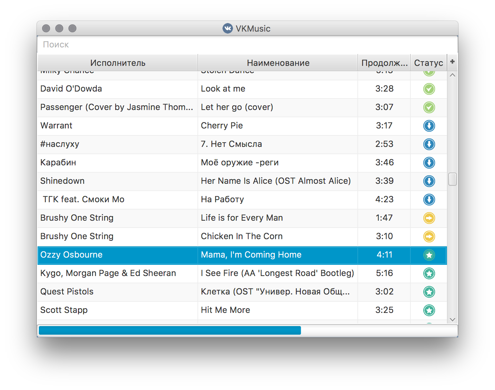

## VKMusic
[](https://travis-ci.org/ruslanys/vkmusic)
[](https://github.com/ruslanys/vkmusic/releases)
[](https://github.com/ruslanys/vkmusic/releases)
[](https://github.com/ruslanys/vkmusic)

### Описание

Десктопное приложение, 

У меня была консольная утилита для выгрузки музыки из ВК, которую я когда-то ~~наговнокодил~~ быстренько 
собрал на коленке. Создавал её как раз тогда, когда начался движ с жесткой вычисткой аудио из ВК по требованиям 
правообладателей, дабы спасти библиотеку. 

Выкачал я тогда музыку и ушел в стримиговый сервис. Время шло, ВК отключил API по работе с аудио, 
добавил защиту "от дурака" по выгрузке MP3, стал вводить ограничения по времени прослушивания и пр. 

Стало интересно разобраться в том, как обойти эту "защиту" и реанимировать приложение. Так появился апдейт, которым я 
поделился с другом, которому была очень нужна такая программка. Но оказалось, консольная утилита вообще непригодна 
для использования не техническими людьми. Чтобы облегчить пользователю жизнь, решил разработать версию с полноценным 
UI и автоматической сихнронизацией.

Хотелось, чтобы UI выглядел нативно на каждой ОС, поэтому был выбран Swing, а не JavaFX.

Берите, пока ~~ВК ничего не сломал~~ работает!!

P.S. Старался максимально качественно написать код, но получилось так, как получилось. Буду рад любым PR.

### Запуск

#### Linux

```$ chmod +x vkmusic-*.jar```

```$ ./vkmusic-*.jar```


#### Linux / Windows / MacOS

```$ java -jar vkmusic-*.jar```


